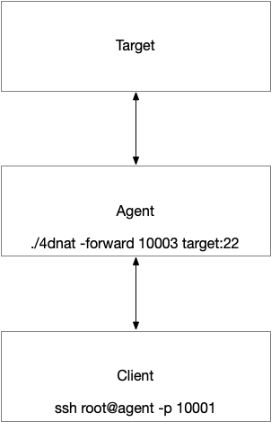
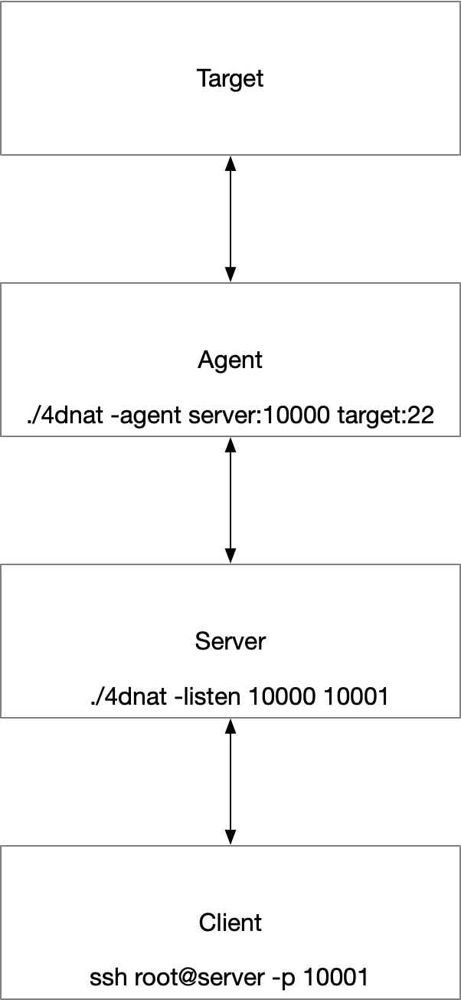

## 4DNAT 
200行go代码实现TCP报文转发，工作在传输层，作用和工作在网络层的DNAT类似，因此我称之为4DNAT。

## 使用方式
1. 转发模式。针对有一台受控主机可以访问内部网络，可以通过端口转发的方式将目标主机的指定端口转发到受控主机的指定端口。

    假设场景如下图：
    
    

    在受控主机上执行
    
    ```
    ./4dnat -forward 2222 192.168.1.100:22
    ```
    
    此时在客户端上访问 65.22.33.44:2222 端口，实际上是访问 192.168.1.100:22
    
    命令详解：
    
    ```
    ./4dnat -forward listenPort targetAddress
    ```

2. 监听模式

    ```
    ./4dnat -listen listenPort0 listenPort1
    ```
    示例：监听本地10000和10001端口，并交换两个端口接收到的数据
    ```
    ./4dnat -listen 10000 10001
    ```
3. 代理人模式

    ```
    ./4dnat -agent targetAddress0 targetAddress1
    ```
    示例：主动连接127.0.0.1的10000端口和127.0.0.1的22端口，并交换两个端口接收到的数据
    ```
    ./4dnat -agent 127.0.0.1:10000 127.0.0.1:22
    ```
   
   监听模式和代理人模式通常搭配使用，假设场景如下图：
   
   
   
   有公网IP主机一台，客户端和目标均可以访问公网。
   
   在公网主机上执行下面的命令监听两个端口
   
   ```
   ./4dnat -listen 10000 10001
   ```
   
   在目标1上指定命令连接公网主机的上面监听的任意一个端口例如10000端口和目标2的22端口
   
   ```
   ./4dnat -agent 65.22.33.44:10000 192.168.1.100:22
   ```
   
   此时在客户端上访问公网主机的10001端口，即是连接目标2的22端口
    ```
    ssh username@65.22.33.44 -p 100001
    ```

## 其他
- -forward 简写为-f
- -listen 简写为-l
- -agent 简写为-a